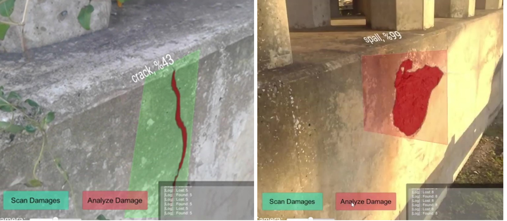

# AI-Assisted-Inspection

## *Introduction:*
The current practice uses conventional measurement tools to assess the cracks, spalling or other damages on the concrete surfaces.
Therefore, it is very subjective and unreliable. This project introduces a smart infrastruction inspection tool for
wearable devices using Mixed Reality and Artificial Intelligence to assist the inspector in collecting real-time information about the concrete damage to enable objective, reliable inspection.

PLEASE CITE THE ORIGINAL PAPER IF YOU WANT THE WORK USEFUL TO YOUR WORK ! 

## *Pre-requisites:*
1-) Unity 2017.4 and above: https://store.unity.com/download-nuo \
2-) Unity TensorFlow Plugin ([Download here](https://s3.amazonaws.com/unity-ml-agents/0.5/TFSharpPlugin.unitypackage)) \
3-) EasyAR Unity SDK: https://www.easyar.com/view/download.html

## *How to Use:*
Simply open the Unity scene and import the necessary plugins (Tensorflow and EasyAR). You can export the inspection app to your desired platform (Android, Windows, IOS)

## *Example Demo*
I have prepared a windows executable. Simply click and run. The system assumes your device has two camera (Front and Back). If you have only one camera, you will have to change the camera parameter to 1 in the Unity app and export it again.

## *Original Paper:*
Karaaslan, E., Bagci, U., & Catbas, F. N. (2019). Artificial Intelligence Assisted Infrastructure Assessment using Mixed Reality Systems. Transportation Research Record. https://doi.org/10.1177/0361198119839988
